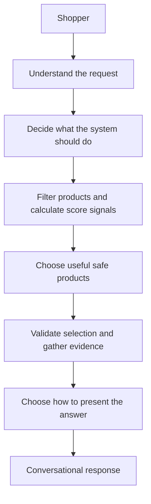
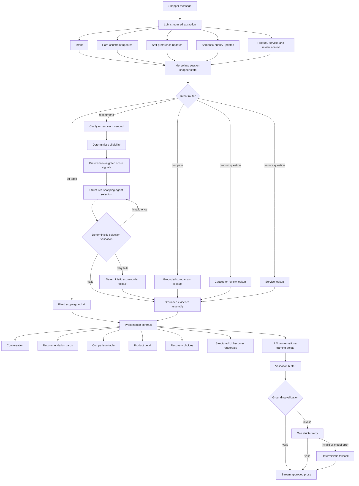
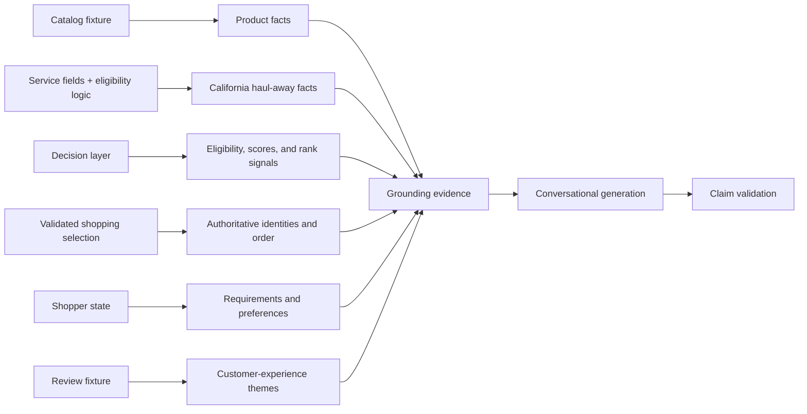
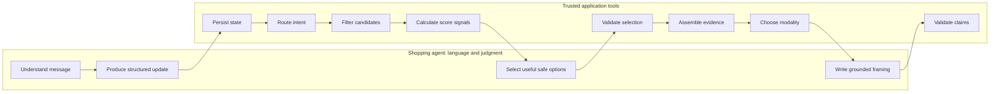

# Architecture Guide

## 1. Project overview

This prototype is a shopping agent with trusted commerce tools. A shopper describes a mattress need naturally. An LLM translates the message into structured intent, requirements, preferences, and context. Application code then defines the safely eligible set and supplies represented facts plus deterministic score signals. A dedicated structured shopping-agent step decides which safe options are most useful to show. Application code validates that selection before any card or conversational recommendation reaches the shopper.

The central architecture principle is:

> **The agent owns shopper-facing judgment. Trusted application tools own eligibility, represented facts, validation, and fallback.**

The LLM is still essential. It interprets natural language, classifies intent, extracts and updates preferences, makes bounded shopping judgments, identifies ambiguity, and writes grounded customer-facing explanations. The boundary is: **the deterministic layer defines what the agent may safely recommend; the shopping agent decides which safe options are most useful to show.**



This is an open-ended conversational interface over a bounded, fixture-backed mattress model. It demonstrates interaction behavior and system boundaries; it is not production commerce infrastructure.

### Shopping behavior v2

The durable shopper state distinguishes three practical meanings. Non-negotiable requirements control eligibility. Numeric targets express desired values such as firmness 6/10 or a preferred budget. Directions express “more” or “less,” such as higher cooling or motion isolation, without manufacturing a numeric target. Semantic priority controls how strongly each supported dimension affects rank.

Ordinary budget and service language is flexible. The decision layer first preserves all non-negotiables, then calculates exact-target status and deterministic tradeoffs for each hard-safe product. If no product satisfies every ordinary target, that is a near-match recommendation state—not a system failure. The presentation shows up to three ranked alternatives with labels such as “$249 above your preferred budget” or “Doesn't include California haul-away.” Allergy, size compatibility, and other genuine non-negotiables are never weakened to create alternatives.

Structured shopper state remains the durable source for ranking. Each extraction call also receives only the last eight conversation messages, a four-record window of recent shopper-visible presentation metadata, catalog product identities, and the prior structured decision result. Recent conversation provides linguistic context. Structured presentation context records what the shopper actually saw: modality, product IDs and order, and the active product, service, or review topic. The agent resolves pronouns, ordinals, topic continuity, and compare→pick follow-ups using both; deterministic catalog/action validation keeps identity and trust boundaries grounded. This is lightweight session metadata, not long-term memory, RAG, or retrieval infrastructure.

## 2. End-to-end architecture

The primary chat path is orchestrated by `engine/conversation.py` and rendered in the default **Shopping Agent** view of `streamlit_app.py`. The **Advanced / Experiments** view preserves the original A/B experiment as a secondary developer surface.



There is normally one structured extraction call per shopper turn. Intent classification and a concrete shopping action are part of that call:

| Shopper meaning | Structured action |
|---|---|
| Compare visible products | `compare_products` with validated product IDs |
| Pick from the latest comparison | `choose_from_products` with that comparison's IDs |
| Ask a product question | `answer_product_question` with product IDs and attribute |
| Continue or switch a service question | `answer_service_question` with product IDs and service attribute |

Recommendation actions reach deterministic eligibility/scoring and the separate structured selection step. Direct comparisons and factual questions use grounded lookups without unnecessary reselection. A compare→pick action restricts the candidate catalog to the compared IDs, so the shopping agent retains choice authority without reopening the catalog. Invalid action identity is rejected internally and retried once with the authoritative presentation context emphasized; when that context already makes the intended comparison set obvious, application code grounds the IDs to it rather than manufacturing shopper-facing confusion.

The presentation contract is built after routing and authoritative results exist. It fixes the modality, product order, table rows, and recovery actions before generated prose is accepted. Structured UI can therefore render before prose generation completes.

### Explicit task-based model routing

`engine/model_config.py` routes application-known work to three model roles without an additional routing call:

| Task role | Examples | Default configuration |
|---|---|---|
| Structured understanding | Intent, constraints, sparse state updates, review topic/source, ambiguity | `gpt-5.6-luna`, reasoning `none` |
| Conversational reasoning | Fuzzy clarification, nuanced recovery, contextual recommendation tradeoffs | `gpt-5.6-luna`, reasoning `low` |
| Fast grounded generation | Comparison framing, review summaries, product/service facts | `gpt-5.6-luna`, reasoning `none` |

The defaults implement the model-selection “start small” rule and reflect the reviewed Luna-vs-Terra experiment. Environment variables can override each role independently. A turn's existing response strategy selects the generation role directly. Fixed guardrails and extraction failures select no model, as do filtering, ranking, recovery proposal construction, presentation selection, and claim validation.

Model routing does not change the evidence supplied to generation, recommendation authority, validation-buffered streaming, retry policy, or deterministic fallback. See [Luna vs Terra model selection](MODEL_BAKEOFF.md) for verified candidate capabilities, pricing, quality bars, and run status.

## 3. One shopper request, end to end

Consider:

> I need a king around $2,000. We sleep hot, and my partner moves around a lot.

The exact structured interpretation is model-produced, but one valid interpretation within the implemented schema is shown below. For the reproducible fixture walkthrough, “sleep hot” and partner movement are represented as 9/10 cooling and motion-isolation targets.

| Structured field | Value |
|---|---|
| Intent | Recommendation |
| Hard requirement | Size: King |
| Soft preference | Budget target: about $2,000 |
| Soft preference | Cooling target: high |
| Soft preference | Motion-isolation target: high |
| Semantic priorities | Cooling: high; motion isolation: high |

### Step 1: Understand

The LLM receives the latest shopper message and the current structured shopper state. It returns a schema-constrained update. It does not choose a product or calculate numeric weights.

The word “around” matters: `$2,000` is represented as a soft budget target, not an absolute ceiling.

### Step 2: Filter

Application code applies the King requirement to the current catalog fixture:

```text
20 fixture products
        ↓ King availability
17 eligible products
```

The ~$2,000 target does not exclude products. Had the shopper said “$2,000 maximum,” price would have become a hard eligibility gate.

### Step 3: Rank

The 17 eligible products are scored against the shopper’s targets using deterministic weights. With cooling and motion isolation both set to `high`, the normalized weights in this example are:

| Dimension | Weight |
|---|---:|
| Price | 0.000 |
| Firmness | 0.208 |
| Support | 0.292 |
| Cooling | 0.250 |
| Motion isolation | 0.250 |

The current fixture and scorer produce a leading order that is supplied as decision support:

1. **ThermaQuiet 6** — $1,435; cooling 8/10; motion isolation 9/10
2. **Night Drift Hybrid** — $1,299; cooling 8/10; motion isolation 8/10
3. **CalmWave Hybrid** — $1,325; cooling 8/10; motion isolation 8/10

This order is diagnostic rather than shopper-facing authority. The shopping agent may preserve it or choose a different useful order from the eligible set. For strong preference signal it may name a primary product; for broad signal it returns an exploratory shortlist with no primary.

### Step 4: Select and validate

The selection call receives the shopper state, latest message, up to eight recent conversation messages, recent product references, eligible products and represented facts, relevant represented review evidence, and score/rank signals. Its strict contract is:

```json
{
  "selection_mode": "exploratory_shortlist",
  "primary_product_id": null,
  "selections": [
    {"product_id": "S15", "reason_tags": ["strong_all_around_option"]},
    {"product_id": "S04", "reason_tags": ["good_value"]}
  ]
}
```

Validation rejects nonexistent or excluded IDs, duplicates, invalid primary/mode combinations, hard-requirement violations, and concrete rationale tags unsupported by represented facts. A sole safe candidate is normalized to singular strong mode. Budget tags distinguish useful spending-range fit from lower-price/value positioning. The system retries once with stricter instructions, then uses deterministic scorer order as a safe fallback. The scorer is therefore still useful for narrowing, rank movement, diagnostics, evaluation, and fallback without dictating every customer-facing choice.

### Step 5: Ground

The system assembles evidence the response is allowed to use:

- catalog facts for every product in the validated selection;
- California haul-away status when represented;
- the authoritative selection mode, selected identities/order, and optional primary product;
- deterministic candidate count, weights, scores, and rank as diagnostic signals;
- the shopper’s active requirements and preferences;
- a relevant fixture-backed review slice when a supported review topic has `high` or `critical` priority.

Review evidence never changes eligibility or deterministic scores. When represented, it may inform which eligible products the shopping agent finds most useful.

### Step 6: Present

Recommendation intent with eligible results deterministically selects `recommendation_cards`. The contract contains up to three products in validated agent-selected order, short supported match reasons, tradeoffs, service indicators when relevant, and field-level grounding sources. Strong mode emphasizes its primary; exploratory mode deliberately avoids implying a false winner. Active consequential requirements are selectively foregrounded; for example, a latex-allergy recommendation explicitly exposes verified latex-free status.

The LLM may rewrite the short conversational framing above those cards. Its output is validated together with the structured presentation contract: cards may carry selected-product identity without forcing duplicate names into the prose, while any explicit prose recommendation remains selection-authority checked.

## 4. Shopper state

The conversation transcript and shopper state serve different purposes.

| Conversation transcript | Structured shopper state | Recent presentation context |
|---|---|---|
| Human and assistant messages | Current requirements, targets, priorities, clarification status, and pending recovery | Last four rendered modalities, product IDs/order, and active topic |
| Supplies linguistic meaning and response-generation context | Supplies durable ranking and decision inputs | Grounds what the shopper actually saw |
| Keeps natural dialogue coherent | Gives application code stable, typed inputs | Bounds and validates agent-resolved references |

The state lives in memory for the current Streamlit session. There is no account profile, database, or cross-session persistence.

Updates are sparse. A null field in a turn update means “leave the prior value unchanged”; an explicit value replaces the old one. Explicit `false` values also matter, such as reversing a latex exclusion or haul-away requirement.

```text
Initial shopper state
Cooling priority: critical
Motion-isolation priority: medium

Shopper: “Actually, motion isolation matters more.”
                         ↓
Updated shopper state
Cooling priority: critical       ← preserved unless explicitly changed
Motion-isolation priority: high  ← updated
```

The extraction call receives the latest message plus the existing structured state. It does not need to reinterpret the full transcript from scratch. Customer-facing generation separately receives up to the last eight conversation messages for tone and continuity.

## 5. Hard constraints and soft preferences

This distinction determines whether a product is excluded or merely ordered lower.

| | Hard constraint | Soft preference |
|---|---|---|
| System effect | Controls candidate eligibility | Influences score and order among eligible products |
| If evidence is missing | Product is treated as unsafe for that requirement | No hard exclusion |
| Examples | King required; $1,500 maximum; no latex; California haul-away required | Around $1,800; medium-firm preferred; cooling matters a lot |

Compare two similar phrases:

```text
“$2,000 maximum”
        ↓
Hard max-price gate
Products above $2,000 cannot qualify

“I’d like to stay around $2,000”
        ↓
Soft budget target
Products remain eligible; price can influence order if price has weight
```

The supported hard constraints are size, maximum price, latex exclusion, and required California haul-away. The supported soft targets are budget, firmness, support, cooling, and motion isolation.

## 6. Conversational preference weighting

Shoppers express priorities semantically: `low`, `medium`, `high`, or `critical`. The decision layer converts those levels to inspectable numeric values, combines them with defaults for unspecified dimensions, and normalizes the result.

Price has zero default ranking weight. It becomes a ranking signal only when the shopper explicitly prioritizes price. A hard maximum remains an eligibility gate regardless of price’s ranking weight.

Changing a priority can rerank the same candidate set:

```text
Before: motion isolation is critical
1. ThermaQuiet 6
2. Serene Motion Max
3. Night Drift Hybrid

Shopper: “Cooling matters more now.”
                    ↓
After: cooling is critical; motion isolation is low
1. Night Drift Hybrid       ↑
2. CalmWave Hybrid          ↑
3. Polar Motion Elite       ↑
```

The products changed position because structured priorities changed the deterministic weights—not because the LLM improvised a different answer. The previous recommendation result is retained so rank movement can be inspected and, when supported, explained conversationally.

## 7. Intent routing

The structured extraction call classifies one of five intents. The router then selects explicit application behavior.

| Shopper language | Intent | Application behavior |
|---|---|---|
| “Find me something cooler.” | `recommend` | Merge state, clarify if needed, then filter and rank |
| “Compare Polar Motion Elite and Night Drift Hybrid.” | `compare` | Resolve exact fixture names or IDs and build a grounded comparison |
| “Does Polar Motion Elite contain latex?” | `product_question` | Look up the requested catalog field |
| “Does haul-away apply to that one?” | `service_question` | Look up California haul-away, using the prior selection when appropriate |
| “Write me a poem about Mars.” | `off_topic` | Return the fixed mattress-shopping scope guardrail |

Product questions may request catalog facts or review evidence. Review topic classification is also included in the same structured extraction result.

Product resolution is deliberately exact: represented product names and SKU IDs are matched without fuzzy or semantic guessing. An unresolved product stays unresolved.

## 8. Clarification and recovery

The system tries to continue the shopping conversation instead of converting ambiguity or an empty result into a generic error.

### Ambiguity and correction

If the LLM marks a hard requirement as ambiguous, the system asks one focused clarification and skips the decision layer. For example, “under $2,000, although maybe $2,500 is my max” can trigger a question asking which number is the true ceiling.

A later correction updates only the stated field. “No, I meant queen, not king” changes size while preserving the saved budget and preferences.

### No exact match

If deterministic filtering returns no eligible product, recovery code tests one-change relaxations against the catalog before offering them.

```text
Shopper
“I need a king under $900 with California haul-away.”
                         ↓
No exact match
                         ↓
Test possible one-change relaxations against the fixture
                         ↓
Budget to $1,275 → 1 match while keeping the other requirements
                         ↓
Offer: Raise budget to $1,275 | Keep current requirements
```

The proposal is stored as pending shopper state. The original $900 ceiling remains active until a later extraction explicitly classifies the shopper’s reply as approval. Rejection clears the proposal and preserves the original requirement.

Exact-product requests use the same boundary. If a shopper asks for a specific mattress that exceeds a saved maximum, the system explains the conflict and asks permission before raising the limit for that product.

Hard constraints are never silently relaxed. If required catalog evidence is missing, the system says it cannot verify the requirement rather than treating unknown as false or suggesting an unsupported relaxation.

### Model or extraction failure

Malformed structured output, a timeout, or another extraction failure preserves the last valid shopper state, skips the decision layer, and returns controlled recovery copy. Internal error details appear only in developer data.

Recommendation readiness is a small semantic field on the existing extraction/state contract: `low`, `exploratory`, or `strong`. Low readiness can trigger one concise, high-value cold-start question; for mattresses, size and approximate budget are the usual first basics because they quickly narrow compatibility and price. Exploratory readiness proceeds directly to differentiated cards without claiming a winner, while strong readiness permits the existing shopping-selection step to make a stronger judgment when a product genuinely stands out. Explicit browse intent bypasses ordinary cold-start clarification, and a shopper who answers only part of a combined question is not automatically nagged for the rest.

This is a progressive interaction pattern for high-consideration shopping, not a questionnaire or onboarding flow: gather minimal useful context, show products, learn from reactions, and refine. Product-card reactions remain normal preference updates, so elicitation continues after results appear without new memory or ranking infrastructure.

Optional finite answers use a renderer-independent elicitation contract with an ID, question, `single_select` response type, exact option-to-state patches, and explicit free-text/skip capabilities. Supported size options come from the catalog vocabulary. Approximate budget options update only `budget_target` and `budget_flex_max`; they never create an absolute ceiling. A matching structured response applies its patch, clears `pending_elicitation`, and reassesses immediately without sending the label through language interpretation. Skip does the same without a patch and requests an exploratory shortlist. Ordinary typed answers still use schema-constrained extraction, while suggested replies remain semantically separate conversational examples. If no structured renderer exists, the question alone is a complete text interaction.

The current Streamlit renderer intentionally uses that text fallback and does not yet render the elicitation options. Its developer diagnostics expose the pending contract and resume metadata; the final shopper-facing control layout is a separate presentation task.

## 9. Grounding

Conversational generation happens after authoritative results exist. Each kind of claim has a defined source:



The LLM can interpret and phrase this evidence, but it cannot invent substitutes. The validation layer checks high-risk claims, including:

- selected-product identity and attempts to recommend a different product;
- stated prices and numeric product-attribute scores;
- latex and haul-away claims;
- review ratings, counts, themes, and invented quotations;
- claims of live inventory, live pricing, live fulfillment, or live review analysis;
- unapproved constraint relaxation.

Unknown remains unknown. A missing field is not converted into “no,” and a blocked recommendation cannot be narrated as a successful one.

If generated prose fails validation, the system makes one retry with stricter grounding instructions. If that also fails—or generation itself fails—it uses deterministic customer-safe fallback copy. Off-topic and extraction-failure messages are fixed guardrails and bypass generative rewriting.

Streaming does not move this boundary. The extraction call remains atomic and non-streamed. Customer-facing generation uses the provider's delta stream, but those deltas stay in a short validation buffer until the complete response passes the same claim validators. Only then does the renderer release the approved prose incrementally. This means cards, comparison tables, product details, and recovery actions can appear at presentation readiness while high-risk generated claims remain invisible until validated. A failed attempt is never partially shown.

## 10. Review evidence

Catalog data describes the product. Review evidence describes how customers tend to experience it.

```text
Catalog fact
Firmness = 6/10

Review evidence
Often described as medium-firm,
with some shoppers finding it firmer than expected.
```

The current review evidence is a precomputed local fixture. It includes average ratings, review counts, qualitative themes, common praise, and common complaints for represented products and topics.

Review evidence may enrich:

- recommendation explanations and product cards when a supported topic is a high or critical priority;
- focused product-review answers;
- review-focused comparison tables.

It does **not** affect eligibility, numeric weights, scores, or deterministic rank order. When represented, it may inform the shopping agent's bounded choice among eligible products. It is also used directly for review questions.

A production system could replace the narrow fixture lookup with semantic retrieval or RAG over a governed review corpus. The interaction architecture could stay the same: retrieve a bounded evidence slice, attach provenance, generate from it, and validate the response. This repository does not implement that production retrieval layer.

## 11. Adaptive presentation

Conversation is the control layer, but not every result should be another text bubble. Application logic selects one of five presentation modalities from intent and result shape.

| Result shape | Presentation modality |
|---|---|
| Simple fact, focused review answer, clarification, off-topic response | Conversation |
| Successful recommendation | Short conversational framing + up to three recommendation cards |
| Two or more resolved products under compare intent | Short conversational framing + comparison table |
| Broad request for one resolved product with no single attribute | Product detail |
| Blocked or conflicting result with an approved-to-offer proposal | Recovery choices |

The LLM writes or rewrites the short framing message. It does not decide whether the UI becomes cards or a table, select comparison rows, reorder products, or alter recovery actions.

The contract is renderer-independent. Streamlit consumes it today, but the same shape could be rendered by another client without moving decision authority into the model.

Streamlit renders structured elements first for the current turn, then streams the validated framing beneath them. Conversation-only turns use the same validated delivery path without an empty structured placeholder. Persisted turns keep the same ordering, avoiding duplicate assistant messages and unnecessary layout movement. A future React client can choose a different visual arrangement while preserving the contract and validation boundary.

## 12. What the LLM controls and what code controls

| LLM | Explicit application logic |
|---|---|
| Interpret natural-language mattress needs | Validate structured output before state changes |
| Classify intent in the extraction call | Route each intent to an explicit strategy |
| Extract sparse hard-constraint, soft-preference, and priority updates | Merge and preserve shopper state |
| Identify blocking ambiguity and propose a clarification question | Enforce hard constraints and unknown-data safety |
| Recognize approval or rejection of pending recovery | Test relaxations and apply only explicit approval |
| Generate conversational explanations from supplied evidence | Convert semantic priorities into weights and calculate score signals |
| Select and order useful products inside the eligible set | Validate the strict selection contract and reject excluded products |
| Choose strong versus exploratory certainty | Preserve hard requirements, represented facts, and unknown-data boundaries |
| Discuss grounded catalog and review evidence | Provide scorer-order fallback when selection generation fails |
| Maintain natural tone using recent conversation context | Select presentation modality and structured UI data |
| Resolve natural references using conversation plus recent presentation context | Validate resolved IDs and constrain compare→pick selection to the displayed set |
| Retry with stricter instructions when asked | Validate claims and provide deterministic fallbacks |

Neither side is incidental. The LLM makes the system conversational and interprets language that rules alone would handle poorly. Code makes consequential recommendation behavior predictable and auditable.

## 13. Fixture-backed and live behavior

| Capability | Current prototype |
|---|---|
| Product catalog and product attributes | Local fixture |
| Prices | Local fixture |
| Size availability | Local fixture |
| California haul-away fields | Local fixture, interpreted by real eligibility and service-lookup code |
| Review evidence | Precomputed local fixture |
| Shopper conversation | Live LLM when configured; deterministic fallback or controlled unavailability otherwise |
| Structured extraction and intent classification | Live LLM with strict JSON Schema |
| Conversational response generation | Live LLM with grounding validation and fallback |
| Response delivery | Provider delta stream buffered through validation; deterministic fallback on failure |
| Eligibility filtering | Real deterministic application code |
| Preference weighting and ranking | Real deterministic application code |
| Recovery analysis and approval handling | Real deterministic application code |
| Presentation selection and payload construction | Real deterministic application code |
| Session state | Real in-memory Streamlit session state |

There is no live Amazon catalog, live inventory, live pricing, production fulfillment integration, real review RAG, vector database, semantic product search, or learned recommendation model. There is also no durable shopper profile or cross-session memory.

Without an API key, the Streamlit app still exposes the deterministic original A/B path under **Advanced / Experiments** with local fallback prose. The primary **Shopping Agent** reports controlled unavailability because its first architectural step is live model-based structured extraction; it does not bypass that boundary.

## 14. Why the prototype is intentionally bounded

The interface accepts open-ended natural language; shoppers are not limited to canned fixture prompts. The system can, however, ground recommendations and factual answers only in attributes and evidence represented by its schemas and fixtures.

That boundary is intentional. The prototype focuses on AI interaction behavior: converting conversation into stable state, separating requirements from preferences, preserving decision authority, recovering safely, grounding explanations, and selecting useful UI structure. Recreating Amazon-scale catalog, fulfillment, search, and review infrastructure would obscure those questions rather than answer them.

The supported domain is therefore broad in phrasing but narrow in authority.

## 15. Developer visibility

The normal shopper view hides implementation detail. An optional sidebar **Developer mode** exposes the latest system state and decision trace, including:

- structured shopper state and the fields changed on the latest turn;
- classified intent and selected response strategy;
- semantic recommendation readiness, pending elicitation/type, selected structured option, explicit browse or skip-to-options intent, and whether cold-start clarification was bypassed;
- whether eligibility and ranking were recomputed;
- active normalized weights, candidate scores, the deterministic scorer leader, and the validated shopping-agent selection;
- recovery proposals, approval state, and supporting match counts;
- grounding data, grounding evidence, review evidence, and validation audits;
- selected modality, structured card or comparison data, actions, and source mappings;
- extraction errors without leaking them into customer copy;
- UTC turn timestamps and monotonic duration metrics for extraction, decision readiness, presentation readiness, generation TTFT, generation completion, first visible response, and total turn time;
- response-path classification: `streamed`, `buffered`, or `deterministic_fallback`.

These views support debugging and evaluation. They are intentionally separate from the shopper-facing experience.

`engine/timing.py` owns this turn-level schema. `presentation_visible_at` is recorded by the renderer because only the client knows when structured UI was actually emitted. User-perceived first-response latency is the earlier of structured-presentation visibility and validated-prose visibility. For the legacy buffered generation API, first-token time is an approximation recorded when the complete model response arrives; the streaming path records the first actual model delta.

## 16. Architectural boundary at a glance



The result is a conversational shopping system in which natural language and shopping judgment remain flexible while product eligibility, selection validity, recovery, evidence, and presentation remain explicit and inspectable.
