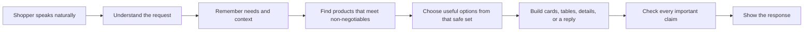

# Architecture Guide

This guide explains how the shopping experience works from a product and design perspective. It assumes no programming background. File names are included only as signposts for readers who want to connect a behavior to its implementation.

## The product in one sentence

The prototype is a mattress shopping assistant that can understand natural conversation, remember a shopper's needs during the session, show safe and useful options, compare products, and answer product, service, or review questions using only information represented in this repository.

It is a prototype, not a live store. The 48 mattresses, prices, service details, and customer-review summaries are synthetic local fixtures. There is no checkout, live inventory, retailer connection, or customer account.

## The central design principle

The experience combines two kinds of decision-making:

- The shopping agent interprets the shopper, makes bounded judgments, chooses useful products from a safe set, and writes natural responses.
- Trusted application rules decide what is eligible, which facts are known, what can appear in the interface, and whether generated language is safe to deliver.

In plain language: **the agent can exercise taste and judgment, but it cannot make up products, facts, or exceptions.**

## What happens after a shopper sends a message

### 1. Understand the message

The first model call turns ordinary language into a structured update. It identifies:

- what the shopper is trying to do: get recommendations, compare, ask about a product, ask about a service, or go off topic;
- non-negotiable requirements, such as a required size or latex exclusion;
- preferences, such as an approximate budget or desired firmness;
- directions, such as “cooler” or “less motion transfer,” without inventing a numeric target;
- how important each preference is;
- references such as “the second one,” “that mattress,” or “which of those two?”;
- whether one focused clarification is genuinely needed.

The model does not decide eligibility or freely answer from its general knowledge. Its job here is to translate the conversation into a constrained, inspectable description of what the shopper means.

### 2. Update the session's shopper profile

The assistant keeps a small structured profile for the current Streamlit session. New messages update only the fields the shopper changed. For example, “Actually, queen instead of king” changes the size while keeping the saved budget and cooling preference.

This is session memory, not a customer profile. It disappears when the session ends and is not stored in a database.

The assistant also keeps two short context windows:

- the last eight conversation messages, which help with tone and linguistic context;
- the last four presentations, which record what the shopper actually saw, including product order and the active topic.

The presentation history is what makes “compare the first two” dependable: “first” and “two” are checked against the actual cards or table, not guessed from prose.

### 3. Route the request

Different shopper goals take different paths:

| Shopper goal | What the product does |
|---|---|
| Get or refine recommendations | Check requirements, score eligible products, and ask the shopping agent to choose a useful safe set |
| Compare products | Resolve exact product identities and build a comparison from represented facts |
| Ask a product question | Look up the requested catalog fact or review topic |
| Ask about haul-away | Use the represented California service field |
| Ask for something unrelated | Briefly steer back to mattress shopping while preserving the shopping context |

Only recommendation requests rerun the full filtering and scoring path. A simple factual question does not silently reshuffle the shopper's shortlist.

### 4. Protect non-negotiables

Before products can be recommended, application rules remove anything that fails a true requirement. The supported requirements are:

- required mattress size;
- an explicitly absolute maximum price;
- latex exclusion;
- mandatory California haul-away.

The wording matters:

| Shopper says | Product meaning |
|---|---|
| “Around $2,000” | A preference; nearby options may still be useful |
| “I absolutely cannot spend over $2,000” | A hard ceiling; higher-priced products are excluded |
| “Haul-away would be nice” | A preference and possible tradeoff |
| “I need California haul-away” | A requirement; only confirmed eligible products remain |

Unknown information stays unknown. If latex status is missing while latex exclusion is required, that product cannot proceed. If an optional cooling value is missing, it is not treated as zero; the product is scored using the optional dimensions that are actually represented.

### 5. Create decision-support signals

Eligible products receive repeatable scores for represented price, firmness, support, cooling, and motion isolation. The shopper's stated priorities change the relative importance of those dimensions.

These scores help narrow a 48-product fixture, expose tradeoffs, support testing, and provide a safe fallback. They are not the final customer-facing judgment. A mechanically highest score can be a poor shortlist choice if three nearly identical products would be less useful than a varied set.

Ordinary preference misses become transparent tradeoffs, such as “$149 above your preferred budget” or “Doesn't include California haul-away.” They do not become hidden failures.

### 6. Let the shopping agent choose within the safe set

A separate structured model step receives the eligible products, represented facts, relevant review evidence, shopper state, recent context, and the deterministic score signals. It returns one of two presentation intentions:

- **Strong recommendation:** the evidence and preferences justify a primary choice.
- **Exploratory shortlist:** several options are worth showing and the available signal does not justify pretending there is one winner.

The result contains product IDs, order, an optional primary product, and short rationale tags. Application rules then verify that every product is eligible, every reason is supported, and the mode is internally consistent. If validation fails, the agent gets one stricter retry. If that also fails, the system safely falls back to deterministic scorer order.

This split is important for the experience: the interface can express confidence honestly without turning every search into either a questionnaire or a forced “best” product.

### 7. Build the interface before writing the final prose

The application chooses a renderer-independent presentation contract. That contract fixes the structure and authoritative product order before conversational wording is accepted.

| Presentation | Used for |
|---|---|
| Conversation | Clarifications, simple facts, review answers, service answers, and scope redirects |
| Recommendation cards | Up to three selected products with match reasons and tradeoffs |
| Comparison table | Side-by-side facts, with the shopper's active priorities shown first |
| Product detail | A broad request about one resolved product |
| Recovery choices | Verified ways forward when no product meets all true requirements |
| Structured elicitation | An optional single-choice question for high-value cold-start basics |

The current Streamlit interface renders cards, comparison tables, product details, recovery actions, and conversational suggested replies. Structured elicitation already has a complete data contract and deterministic resume path, but the current interface uses its typed-text fallback rather than dedicated choice controls.

### 8. Validate customer-facing language

The response model receives a narrow evidence packet rather than the full catalog. Generated wording is held in a buffer until the complete response passes grounding checks.

The checks reject, among other things:

- a different or reordered product selection;
- a product that failed a requirement;
- invented or contradictory price, material, score, latex, or haul-away claims;
- invented review ratings, counts, themes, or quotations;
- an unapproved change to a hard requirement;
- claims of live inventory, live pricing, fulfillment, checkout, or live review analysis.

If the first response fails, the model receives one stricter retry. If the retry fails or the model is unavailable, the shopper receives deterministic fallback copy assembled from represented facts. Unsafe partial prose is never shown and then retracted.

Structured UI can become renderable as soon as its contract is ready. Approved prose is then released as a stream. Turn timing records interpretation, decision, presentation, first generated token, first visible response, and completion so the latency tradeoff remains inspectable.

## Clarification, cold starts, and recovery

The experience aims for useful products quickly.

- A nearly empty request may ask once for size and approximate budget because those answers materially improve the first set of options.
- A shopper who explicitly asks to browse can skip ordinary cold-start questions.
- Once there is enough information for an exploratory shortlist, products appear instead of another questionnaire step.
- Reactions to shown products update preferences and immediately refine results.
- Genuine ambiguity around a hard requirement triggers one focused question.
- A model or schema failure preserves the last valid state and does not run a decision from partial data.

When no product meets every ordinary preference, the assistant shows near matches with clear tradeoffs. When no product meets true requirements, it can offer only verified one-change recovery options. A hard requirement changes only after the shopper explicitly accepts that change, and latex safety is never proposed as a relaxation.

## Catalog facts and review evidence stay separate

The catalog fixture is the source for product specifications and service status. The review fixture is a separate source for synthetic customer-experience evidence such as average rating, review count, themes, praise, and complaints.

That separation allows the assistant to say, for example, that a mattress is listed at one firmness while represented reviewers describe a different felt experience. One source does not overwrite the other.

Reviews never change hard eligibility or deterministic scores. Relevant represented review themes may help the shopping agent choose among safe products and may appear in grounded cards, comparisons, or answers. There is no live review retrieval, web search, review ingestion, embedding index, or vector database.

Both fixtures intentionally contain incomplete optional metadata. Missing values are omitted when appropriate; they are never silently converted to “no” or a zero score. Every one of the 48 catalog products has a review record, but topic coverage varies deliberately so unknown-topic behavior can be tested.

## Which model handles which job

The application already knows the kind of work it needs, so it selects a model role directly instead of asking another model to route the request.

| Role | Product responsibility | Default |
|---|---|---|
| Structured understanding | Interpret intent, preferences, references, and ambiguity | `gpt-5.6-luna`, no reasoning effort |
| Conversational reasoning | Shopping selection, nuanced clarification, recovery, and tradeoff framing | `gpt-5.6-luna`, low reasoning effort |
| Fast grounded generation | Comparisons, review summaries, and factual responses | `gpt-5.6-luna`, no reasoning effort |

Filtering, scoring, recovery-option construction, selection validation, presentation choice, claim validation, and fallback copy do not require a model. The three model names can be overridden independently through environment variables. The selection evidence is documented in [Luna vs Terra model selection](MODEL_BAKEOFF.md).

## Ownership at a glance

| Product responsibility | Main implementation area |
|---|---|
| Coordinate a complete turn | `engine/conversation.py` |
| Understand and merge shopper needs | `engine/preference_extraction.py` |
| Filter, score, and describe tradeoffs | `engine/decision.py` |
| Choose products from the eligible set | `engine/shopping_selection.py` |
| Resolve comparisons and factual questions | `engine/response_strategy.py` |
| Propose safe ways out of a blocked search | `engine/recovery.py` |
| Choose cards, tables, details, or conversation | `engine/presentation.py` |
| Assemble evidence and validate claims | `engine/grounding.py` |
| Generate and validate conversational wording | `engine/conversational_response.py` and `engine/explanation_llm.py` |
| Provide customer-safe local fallback copy | `engine/customer_copy.py` |
| Hold synthetic catalog and review evidence | `engine/data.py` and `engine/review_data.py` |
| Render the product and developer views | `streamlit_app.py` |

## What the prototype deliberately does not include

- live inventory, pricing, fulfillment, or checkout;
- retailer, marketplace, catalog, or review APIs;
- web search, semantic product retrieval, RAG, or learned ranking;
- durable shopper profiles, authentication, analytics, or a database;
- production monitoring, security hardening, or reliability controls;
- a production-scale catalog-narrowing service.

The bounded fixtures are a deliberate product-development tool: they make conversation behavior, presentation choices, missing-data handling, and trust boundaries visible and reproducible. They should not be mistaken for production commerce infrastructure.

## Evaluation boundary

The repository evaluates two responsibilities separately:

- **System Integrity** checks hard requirements, factual grounding, recommendation identity, and state preservation. These are release-blocking trust boundaries.
- **Shopping Experience** judges natural understanding, momentum, tone, tradeoff quality, context continuity, shortlist usefulness, and appropriate certainty.

A delightful answer cannot excuse an integrity failure, and a technically valid answer is not automatically a good shopping experience. See the [evaluation framework](EVALUATION.md) for the current suites and evidence.
