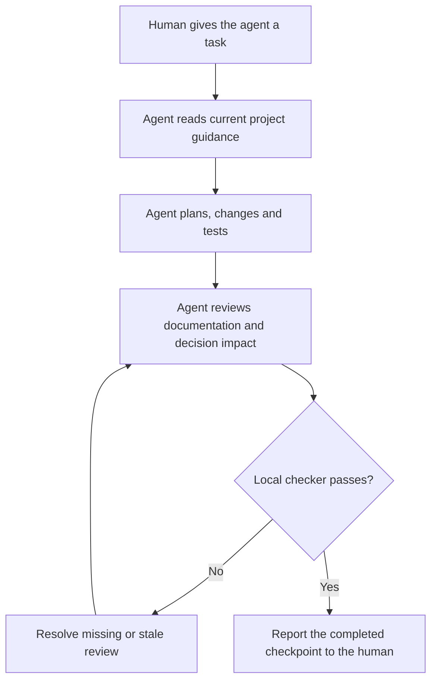
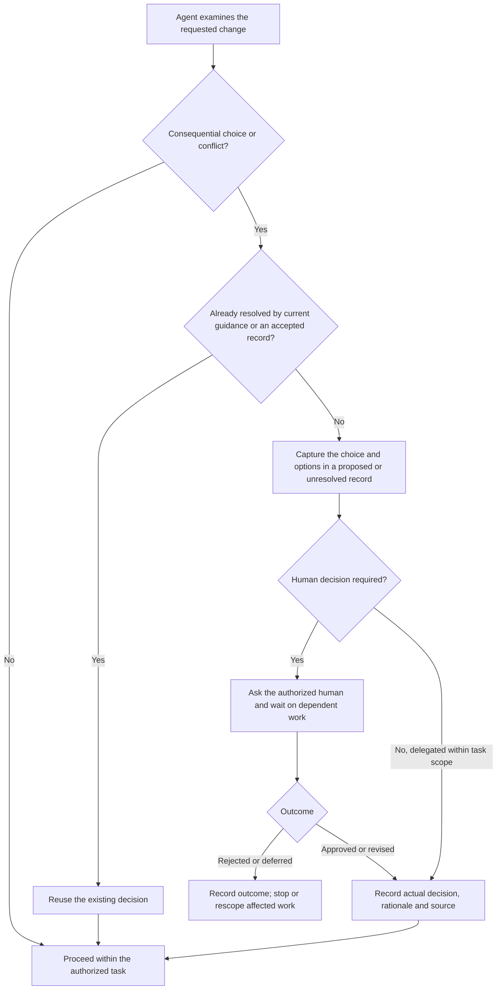
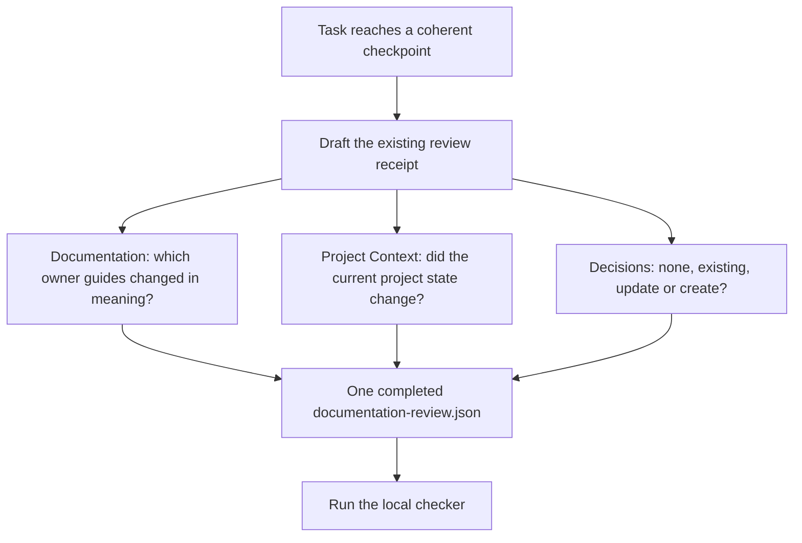
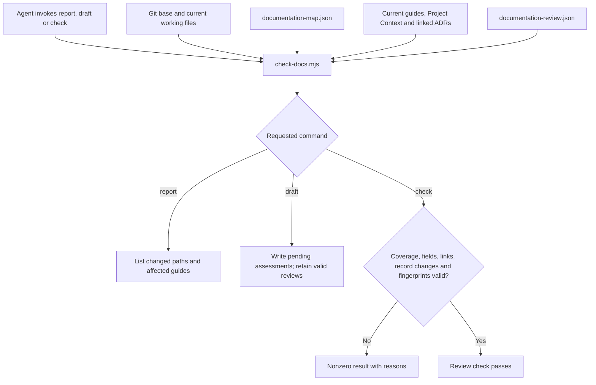
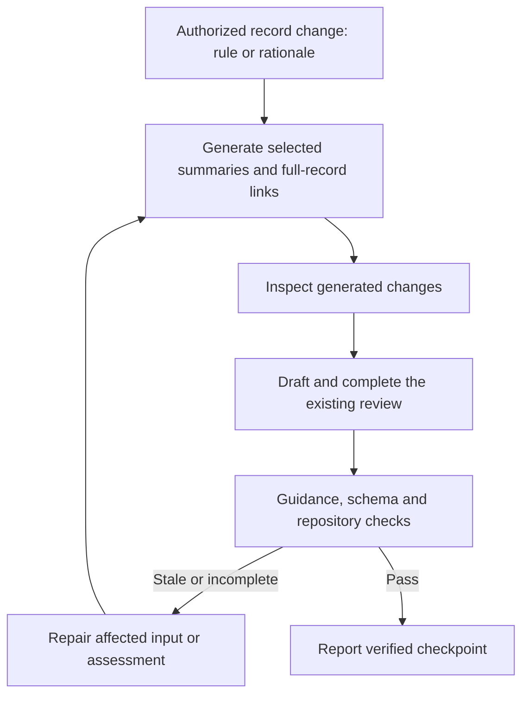

# How Groundwork's impact review works

Current local implementation · October 1, 2026 · Pinned canonical core 0.1.0-rc.2

Groundwork gives the coding agent a working process and a local checker. The agent interprets the task, makes authorized changes, and reviews their impact. The checker verifies that the required review is complete and still matches the files. The human retains the decisions that require human approval.

The pre-extraction fixes add a guidance-generation check before review and explicit receipt-v3 migration. [Installed contracts](GROUNDWORK-CONTRACTS.md) describe those inputs and commands. A missing field blocks the affected check, not all work.

Read the diagrams in order. Each shows a different part of the same process, not a separate entry point or additional review ceremony.

## 1. The simple view



The review happens at a coherent task checkpoint, not after every edit. Consequential uncertainty can require a human decision earlier, before the agent implements the affected work. That branch is shown next. A successful checkpoint does not automatically commit, push or deploy.

## 2. Where human judgment enters



This branch can occur during planning or when something is discovered while coding. Routine technical choices stay with the agent within the authorized scope. A proposed ADR preserves an open question; it does not grant permission to implement the proposal. These are instructions the agent must follow, not an installed runtime approval interceptor.

A decision record is needed when a choice establishes durable behavior, resolves conflicting guidance, changes an important boundary or evaluation criterion, or makes a consequential tradeoff. File count and code size are not the trigger.

## 3. One checkpoint, three questions



These are three fields or sections in one review, not three passes through the task.

| Question | What the agent does | Where it lives |
| --- | --- | --- |
| Owner documentation | Update affected descriptions, or explain no impact | Review groups plus the affected guides |
| Project Context | Assess whether the short current-state overview needs an update | projectContext plus PROJECT-STATE.md |
| Decision impact | Explain whether to reuse, update or create a decision record, or why none is needed | decisionImpact plus linked ADRs |

The documentation map suggests affected guides from changed paths. The agent must add any additional coverage warranted by meaning. An ADR explains why a choice was made. Project Context describes what is true now. The receipt records that the current change was reviewed; it is not another project narrative.

| Decision disposition | Example | Additional record work |
| --- | --- | --- |
| none | Reword a placeholder without changing behavior | No ADR |
| existing | Restore the approved user-message scrolling behavior | Link unchanged DR-0001 |
| update | Add verification evidence or follow-up to an existing record | Update that record while preserving its original rationale |
| create | Propose a different scrolling interaction | Create a proposed record; resolve required approval before implementation |

Dispositions are relative to the selected Git base. If a new ADR was created earlier in the same uncommitted change, later work on it still counts as create. A material reversal of an accepted decision needs a successor record, not a silent rewrite.

## 4. What the checker actually connects



The agent runs these commands. No hook, remote CI job or nightly schedule currently invokes this checker automatically. The checker does not call another LLM or execute a policy engine.

A fingerprint is a hash of the relevant file contents and review inputs. It ties the assessment to a particular state of the change. Editing a relevant input makes the prior fingerprint stale. The receipt itself is excluded from the change hash so completing it does not invalidate itself.

```mermaid
sequenceDiagram
    participant A as Coding agent
    participant F as Repository files
    participant C as Local checker
    participant R as Review receipt
    A->>F: Finish a coherent change
    A->>C: Run draft
    C->>R: Pending assessments and current fingerprints
    A->>R: Supply rationale, disposition and record links
    A->>C: Redraft if record links changed
    C->>R: Bind linked records; keep assessment pending
    A->>R: Complete review against current files
    A->>C: Run check
    C-->>A: Pass or actionable errors
    opt Relevant files change afterwards
        A->>F: Make another edit
        A->>C: Run check
        C-->>A: Prior assessment is stale
        A->>C: Redraft and reconsider affected assessments
    end
```

Unaffected documentation groups can retain their reviews. Project Context and decision impact cover the whole nonhistorical change, so those short assessments reopen when that change changes. This is reconsideration at the next checkpoint, not a requirement to fill out forms while typing.

## Responsibility and limits

| Human | Coding agent or reviewer | Deterministic checker |
| --- | --- | --- |
| Sets intent and approves choices requiring human authority | Interprets the task and decides what documentation or ADR work is warranted | Checks required fields and documentation coverage |
| Can reject, revise or defer proposals | Reviews actual changes, updates guides and explains decisions | Checks linked records exist and match create/update/existing claims |
| Authorizes publishing separately | Runs appropriate product tests and the impact check | Rejects missing, incomplete or stale assessments |

The checker cannot tell whether a plausible explanation is actually correct. In Pass 2, an intentionally incorrect none assessment passed structural checks. This is a specific boundary: review completeness is enforced when the command is run; semantic judgment and human authority are still handled by the working process.

Product verification is a separate concern. Unit tests, evaluations and browser review assess the implementation at the relevant level; a documentation check does not replace them. The offline runner is available for isolated product verification but does not run the documentation checker automatically.

## Files to open

- [Working instructions and exact commands](README.md)
- [Decision criteria and record index](../decisions/README.md)
- [Current Project Context](../PROJECT-STATE.md)
- [Documentation routing map](../documentation-map.json)
- [Current review receipt](../documentation-review.json)
- [Checker implementation](../../scripts/check-docs.mjs)
- [Pass 2 examples and measured overhead](../work/DECISION-IMPACT-PASS-2.md)

This guide describes the installed local workflow. It does not introduce a new approval service, classifier, orchestration layer or publishing step.

## Generated guidance before the review checkpoint



A generation or migration failure blocks that operation. Independent authorized work can continue. If the record itself leaves intent or authority unresolved, pause the dependent implementation. [Eight workflow trials](../work/PRE-EXTRACTION-FIX-PASS-3.md) tested recovery and lifecycle behavior; no source synchronization runs automatically in the background.

## Installed ownership

The wrappers in scripts/ forward to .groundwork/core/. The installation manifest pins upstream identity and managed hashes; .groundwork/config.json and project knowledge remain locally owned. Legacy modules under docs/history/pre-canonical-groundwork are evidence only. Updating the shared implementation requires a reviewed candidate update, not editing the managed copy.
